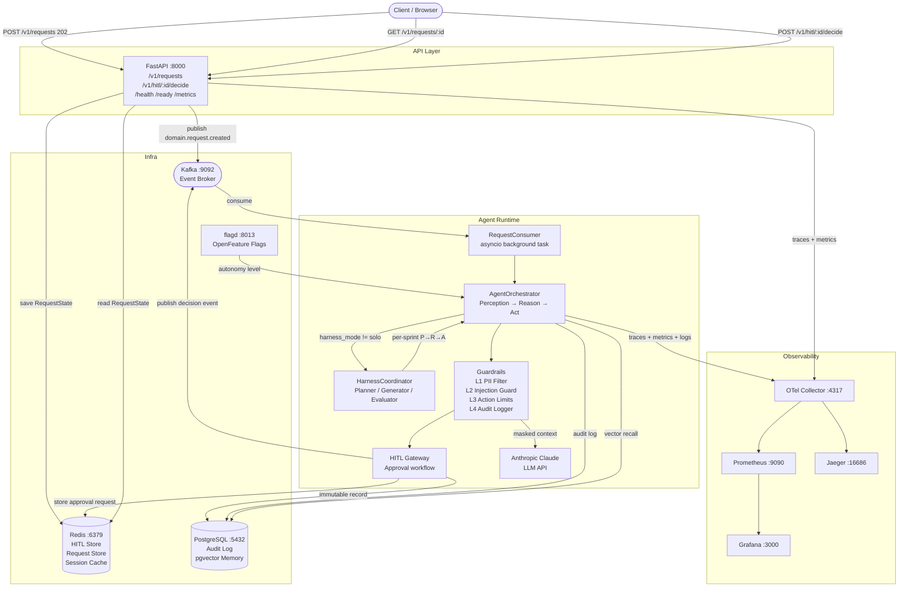
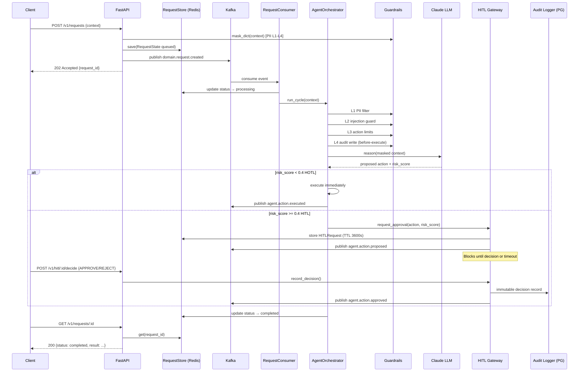

# System Architecture

**Owner:** Tech Lead | **Last updated:** 2026-05-27
**ADR references:** ADR-0001, ADR-0002, ADR-0003, ADR-0004, ADR-0010, ADR-0011

---

## System Topology

---

## Request Lifecycle (Happy Path)

---

## Harness Mode Selection

See `specs/ai/harness-design.md` for the full sprint loop diagram.

| Mode         | When to use                          | Cost multiplier |
| ------------ | ------------------------------------ | --------------- |
| `solo`       | Single-step, clear scope, < 20 min   | 1×              |
| `simplified` | Feature-level, 30 min – 2 h          | 5–10×           |
| `full`       | Multi-feature, ambiguous scope, 2 h+ | 15–25×          |

Controlled by `settings.harness_mode` (default: `solo`).

---

## Infrastructure Fallback Pattern

Every infra dependency has an in-memory fallback for local dev:

| Production             | Local fallback         | Blocked in production?          |
| ---------------------- | ---------------------- | ------------------------------- |
| `RedisRequestStore`    | `InMemoryRequestStore` | No                              |
| `HITLRedisStore`       | `InMemoryHITLStore`    | No                              |
| `KafkaEventBroker`     | `InMemoryBroker`       | No                              |
| `PostgresAuditStorage` | `InMemoryAuditStorage` | **Yes** — raises `RuntimeError` |

---

## Key Module Map

| Layer         | Module                                    | Role                                     |
| ------------- | ----------------------------------------- | ---------------------------------------- |
| API           | `src/api/rest/main.py`                    | FastAPI app, lifespan wiring             |
| Routers       | `src/api/rest/routers/`                   | `requests`, `hitl`, `health`             |
| Worker        | `src/workers/request_consumer.py`         | Asyncio background consumer              |
| Orchestrator  | `src/agents/orchestrator/orchestrator.py` | P→R→A loop                               |
| Harness       | `src/agents/harness/coordinator.py`       | Planner/Generator/Evaluator              |
| HITL          | `src/agents/hitl_gateway.py`              | Approval workflow                        |
| Guardrails    | `src/guardrails/`                         | PII, injection, limits, audit            |
| Memory        | `src/memory/`                             | Vector store, session cache, bug history |
| Feature Flags | `src/shared/feature_flags.py`             | Autonomy levels via OpenFeature          |
| Config        | `src/shared/config.py`                    | All settings via Pydantic                |
| Observability | `src/observability/`                      | OTel, Prometheus, structured logs        |
