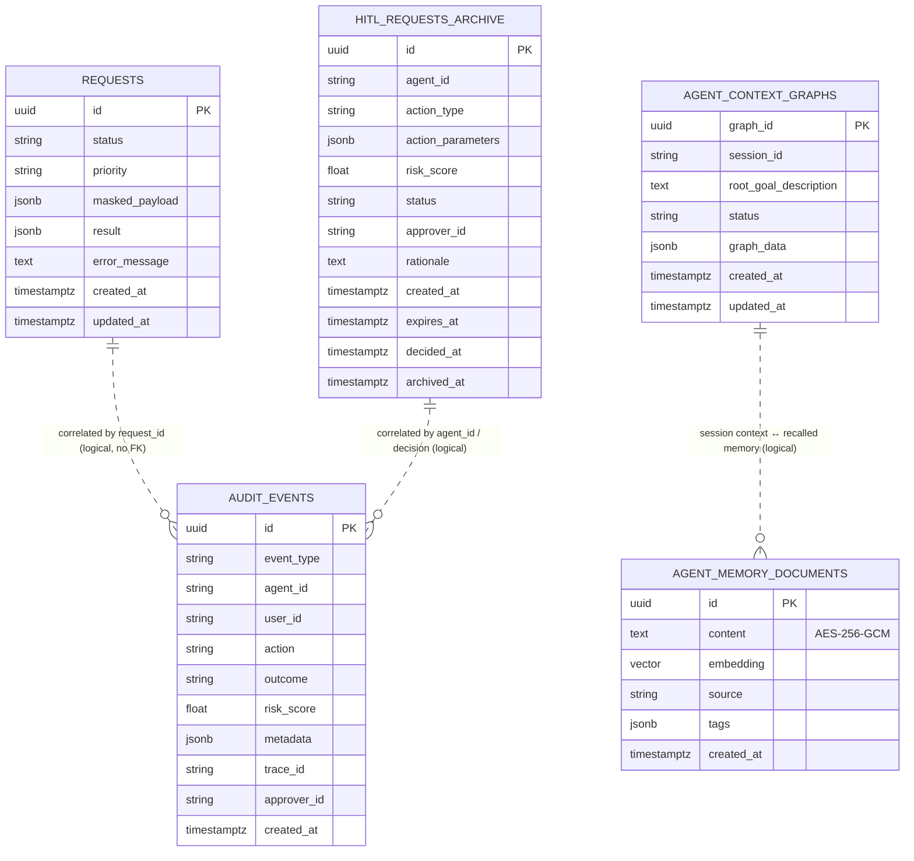

# Entity-Relationship Diagram

> **Owner:** Tech Lead | **Status:** Living diagram
> Logical view of the PostgreSQL tables and how they relate. **There are no database-level foreign
> keys** between these tables — the system is event-sourced and loosely coupled, so entities are
> correlated by shared identifiers (`request_id`, `agent_id`, `trace_id`), not FK constraints. The
> per-table detail (owner, PII class, encryption, retention) lives in
> `docs/data/data-model-catalog.md`; migrations in `docs/data/migrations.md`.

> Dotted relationships (`..`) denote **logical correlation only** — enforced in application code and
> traces, not by the database. This is intentional (ADR-0003 async strategy, ADR-0017 memory).

## Immutability & encryption at a glance

- `audit_events`, `hitl_requests_archive` — **append-only** (UPDATE/DELETE revoked at the SQL level,
  ADR-0026/SOX).
- `agent_memory_documents.content` — **encrypted** at rest (AES-256-GCM, ADR-0018).
- All L1/L2 columns use `EncryptedField`; classification in `docs/data/data-classification.md`.

## Storage notes

- RDBMS: **Aurora PostgreSQL** (ADR-0062) with `pgvector` + `pgcrypto` (migration 0002).
- Operational state (request lifecycle, HITL pending) also lives in **Redis** — see
  `docs/data/redis-key-standards.md`.
- Event schemas (the "data in motion") are in `infrastructure/message-broker/schema-registry/avro/`.

## Related

- `docs/data/data-model-catalog.md` · `docs/data/migrations.md` · `docs/data/data-classification.md`
- `docs/reference/request-lifecycle.md` — how these tables are written during a request
